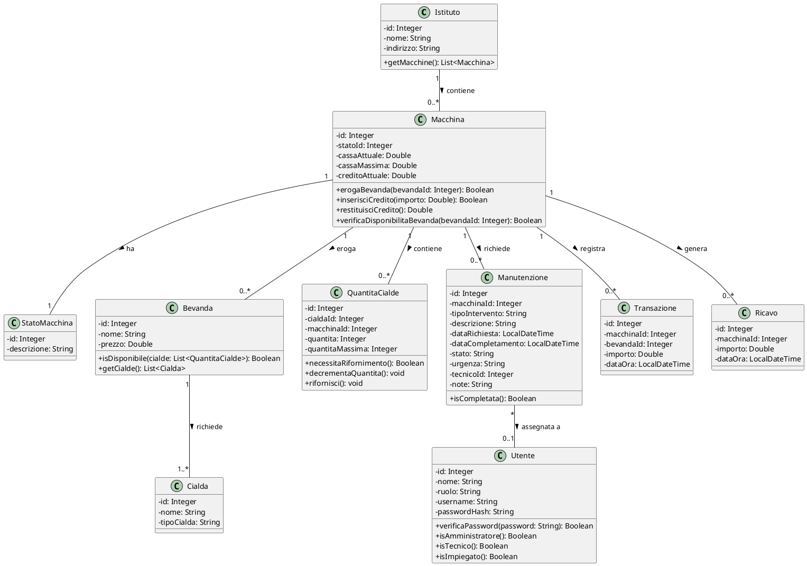
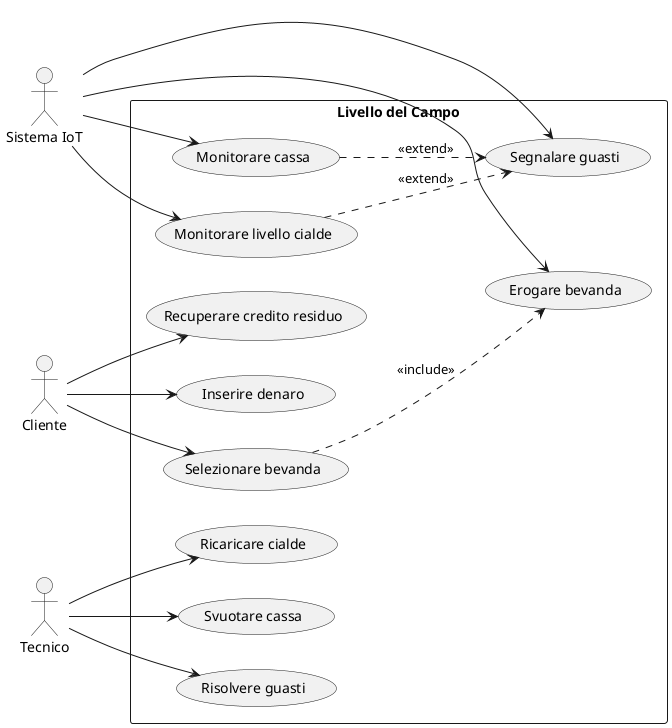
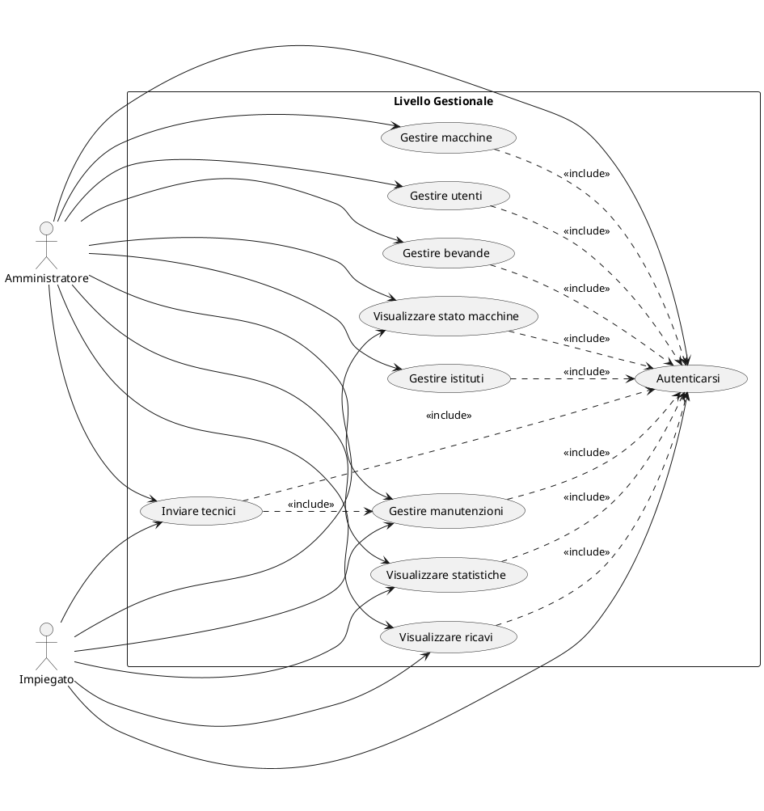
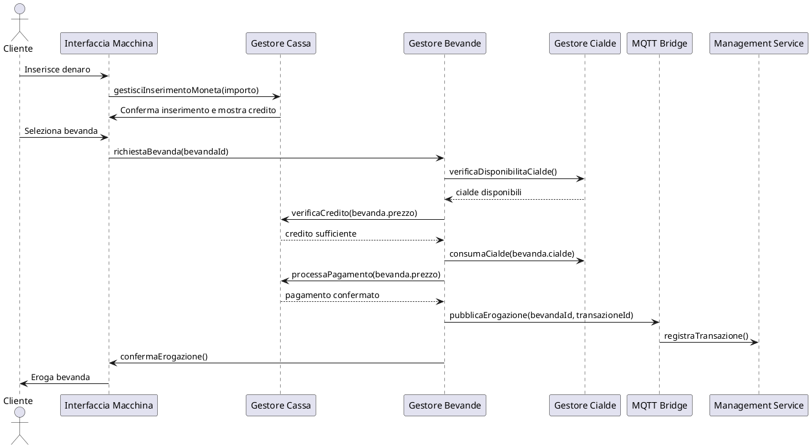
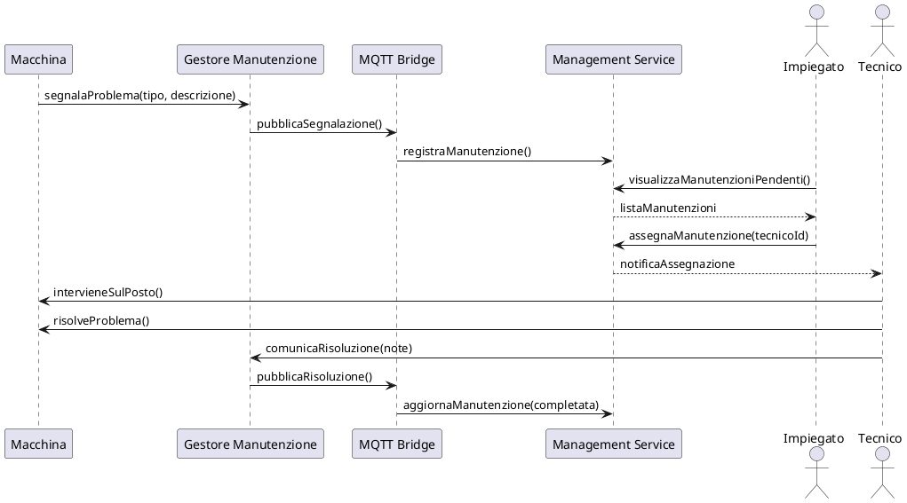

# Specifica di Dominio e Casi d'Uso

## Diagramma delle Classi del Dominio

Questo diagramma rappresenta le principali entità del sistema e le loro relazioni:

### Descrizione delle Entità del Dominio
- **Istituto**: Rappresenta la scuola dove sono installate le macchine distributrici.
- **Macchina**: Rappresenta il distributore automatico di bevande calde con le sue funzionalità.
- **StatoMacchina**: Definisce lo stato operativo della macchina (Attiva, In Manutenzione, Fuori Servizio).
- **Bevanda**: Rappresenta una bevanda erogabile dalla macchina.
- **Cialda**: Rappresenta le cialde utilizzate per preparare le bevande.
- **QuantitaCialde**: Rappresenta la quantità di cialde di un certo tipo disponibili in una specifica macchina.
- **Manutenzione**: Registra le attività di manutenzione richieste o completate.
- **Transazione**: Registra ogni erogazione di bevanda effettuata.
- **Ricavo**: Registra gli importi prelevati dalle casse delle macchine.
- **Utente**: Rappresenta un utente del sistema gestionale con specifici ruoli e permessi.

## Diagramma dei Casi d'Uso
I casi d'uso sono divisi in due parti: livello del "campo" per le funzionalità delle macchine e livello "gestionale" per l'amministrazione.

### Casi d'Uso - Livello del "Campo"

### Descrizione Casi d'Uso - Livello del "Campo"
1. **Inserire denaro**: Il cliente inserisce monete nella macchina per accumulare credito.
   - L'importo viene aggiunto al credito attuale se c'è spazio in cassa.
   - Se la cassa è vicina alla capacità massima, il denaro potrebbe essere rifiutato.

2. **Selezionare bevanda**: Il cliente sceglie una bevanda tra quelle disponibili.
   - Il sistema verifica la disponibilità delle cialde necessarie.
   - Il sistema verifica che il credito sia sufficiente.

3. **Recuperare credito residuo**: Il cliente può richiedere la restituzione del credito non utilizzato.

4. **Erogare bevanda**: Il sistema eroga la bevanda selezionata.
   - Consuma le cialde necessarie.
   - Decrementa il credito.
   - Incrementa la cassa.
   - Registra la transazione.

5. **Monitorare livello cialde**: Il sistema controlla costantemente le quantità di cialde disponibili.
   - Se una tipologia di cialda scende sotto la soglia minima, si genera una segnalazione.

6. **Monitorare cassa**: Il sistema controlla il livello di riempimento della cassa.
   - Se la cassa supera una soglia di riempimento (es. 80%), viene generata una segnalazione.

7. **Segnalare guasti**: Il sistema può segnalare guasti o esigenze di manutenzione.
   - Può essere attivato automaticamente dal monitoraggio o manualmente.

8. **Ricaricare cialde**: Il tecnico rifornisce le cialde esaurite o in esaurimento.

9. **Svuotare cassa**: Il tecnico rimuove il denaro dalla cassa quando è piena.
   - L'importo rimosso viene registrato come ricavo.

10. **Risolvere guasti**: Il tecnico interviene per risolvere i problemi tecnici segnalati.

### Casi d'Uso - Livello "Gestionale"

### Descrizione Casi d'Uso - Livello "Gestionale"
11. **Gestire istituti**: L'amministratore può aggiungere, modificare o rimuovere istituti.
    - Un istituto può essere rimosso solo se non ha macchine associate.

12. **Gestire macchine**: L'amministratore può installare, configurare o ritirare macchine.
    - Include l'assegnazione delle macchine agli istituti.
    - Include la configurazione delle bevande e cialde disponibili per ogni macchina.

13. **Visualizzare stato macchine**: Permette di monitorare lo stato di tutte le macchine.
    - Visualizza lo stato operativo (attiva, in manutenzione, fuori servizio).
    - Mostra i livelli di cialde e lo stato della cassa.

14. **Gestire utenti**: L'amministratore può creare, modificare ed eliminare account utente.
    - Assegna ruoli specifici (amministratore, impiegato, tecnico).

15. **Inviare tecnici**: Assegna interventi di manutenzione ai tecnici disponibili.
    - Include la prioritizzazione degli interventi in base all'urgenza.

16. **Visualizzare ricavi**: Permette di consultare i ricavi generati dalle macchine.
    - Filtrabile per periodo, istituto o macchina.

17. **Gestire manutenzioni**: Permette di tracciare e gestire le richieste di manutenzione.
    - Include la registrazione dell'esito degli interventi.

18. **Autenticarsi**: Tutti gli utenti devono autenticarsi per accedere al sistema gestionale.
    - Verifica credenziali e assegna i permessi in base al ruolo.

19. **Visualizzare statistiche**: Permette di analizzare dati su consumi, guasti e ricavi.
    - Include report e grafici per supportare le decisioni gestionali.

20. **Gestire bevande**: L'amministratore può configurare le bevande disponibili.
    - Include la definizione delle cialde necessarie per ogni bevanda.
    - Include l'impostazione dei prezzi.

## Diagramma di Sequenza - Erogazione Bevanda
Per illustrare meglio l'interazione tra componenti, ecco un diagramma di sequenza per l'erogazione di una bevanda:

## Diagramma di Sequenza - Segnalazione e Intervento di Manutenzione
